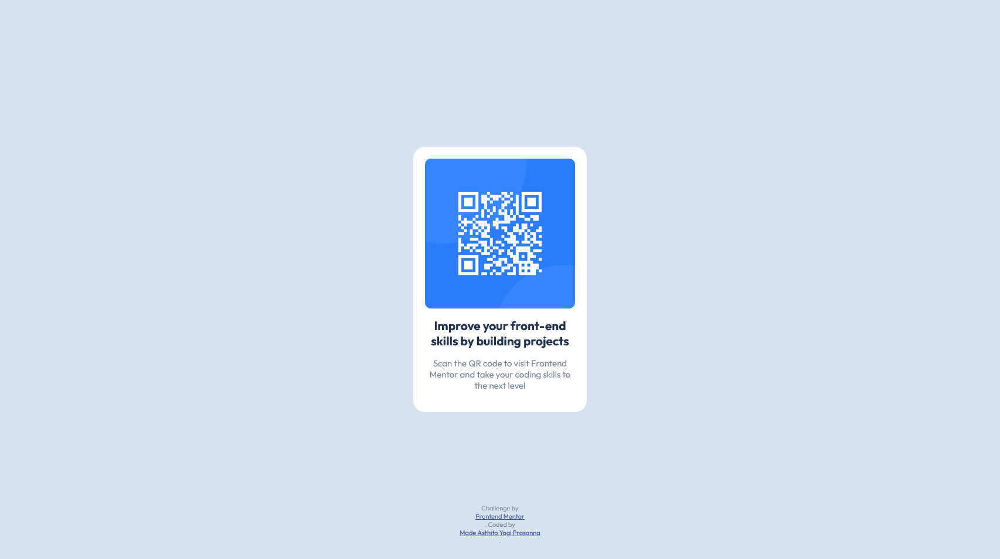

# Frontend Mentor - QR code component solution

This is a solution to the [QR code component challenge on Frontend Mentor](https://www.frontendmentor.io/challenges/qr-code-component-iux_sIO_H). Frontend Mentor challenges help you improve your coding skills by building realistic projects. 

## Table of contents

- [Overview](#overview)
  - [Screenshot](#screenshot)
  - [Links](#links)
- [My process](#my-process)
  - [Built with](#built-with)
  - [What I learned](#what-i-learned)
- [Author](#author)

## Overview

### Screenshot

### Links

- Live Site URL: [Add live site URL here](https://qr-component-challenges.vercel.app/)

## My process

### Built with

- HTML5
- CSS custom properties
- Flexbox

### What I learned

I learnt more about the basic in css

## Author

- Frontend Mentor - [@MadeAsthito](https://www.frontendmentor.io/profile/MadeAsthito)
- Linkedin - [Made Asthito Yogi Prasanna](www.linkedin.com/in/made-asthito-yogi-prasanna-496520289)
